## Pi-hole Install: 

The Pi-hole® is a DNS sinkhole that protects your devices from unwanted content, without installing any client-side software. Its open-source software which helps ensure you are the sole person in control of your privacy. It helps block advertisements and trackers across all devices connected to your network, enhancing privacy and reducing unwanted content.


#### Supported Operating Systems:

The following operating systems are officially supported:

- Raspberry Pi OS (formerly Raspbian)
- Armbian OS
- Ubuntu
- Debian
- Fedora
- CentOS Stream


### Prerequisites: 

- Pi-hole functions as a DNS server, so a **static IP is recommended**.
- Ensure no conflicting services (like other DNS resolvers) are running on port `53`.


### Install Required Dependencies:

```
dnf install -y epel-release
dnf install -y curl git wget bind-utils unzip
```


### Download and Install Pi-hole:

Follow the interactive installer. You'll need to configure:

- **Static IP Address**: Ensure the IP address matches the static IP you set earlier.
- **Select Upstream DNS Provider**: Choose a DNS provider. Common options include Google, OpenDNS, and Cloudflare.
- **Ads blocks**: Pi-hole will provide a default ads blocklist. You can add more lists later if needed.
- **Web Admin Interface**: Enable the web admin interface and log queries if you want to monitor and manage Pi-hole via a web browser.
- **Install web server (Lighttpd)**: Choose to install the web server component if you want to use the web admin interface.
- **Enable Logging**: Log queries (optional).
- **Privacy Mode**: Select the level of privacy for statistics logging.


_Run the automated Pi-hole installation script:_

```
curl -sSL https://install.pi-hole.net | bash
```


_If Error:_

```
[✗] Unsupported OS detected: Rocky 8.8
```


Or,


```
curl -sSL https://install.pi-hole.net | PIHOLE_SKIP_OS_CHECK=true bash
```


```
### Output:

  [✓] Root user check

        .;;,.
        .ccccc:,.
         :cccclll:.      ..,,
          :ccccclll.   ;ooodc
           'ccll:;ll .oooodc
             .;cll.;;looo:.
                 .. ','.
                .',,,,,,'.
              .',,,,,,,,,,.
            .',,,,,,,,,,,,....
          ....''',,,,,,,'.......
        .........  ....  .........
        ..........      ..........
        ..........      ..........
        .........  ....  .........
          ........,,,,,,,'......
            ....',,,,,,,,,,,,.
               .',,,,,,,,,'.
                .',,,,,,'.
                  ..'''.

  [✓] Default SELinux: disabled
  [✓] Current SELinux: disabled
  [✓] EPEL repository already installed

  [✓] Checking dnf for upgraded packages... 237 updates available
  [i] It is recommended to update your OS after installing the Pi-hole!

  [i] Checking for / installing Required dependencies for OS Check...
  [✓] Checking for grep
  [✓] Checking for bind-utils

  [i] PIHOLE_SKIP_OS_CHECK env variable set to true - installer will continue
  [i] Checking for / installing Required dependencies for this install script...
  [✓] Checking for git
  [i] Checking for dialog (will be installed)
  [✓] Checking for iproute
  [✓] Checking for newt
  [✓] Checking for procps-ng
  [✓] Checking for chkconfig
  [✓] Checking for ca-certificates
  [i] Processing dnf install(s) for: dialog, please wait...
----------------------------------------------------------------------
Last metadata expiration check: 0:05:06 ago on Wed 01 Jan 2025 05:14:53 AM +06.
Dependencies resolved.
==================================================================================================================================================
 Package                       Architecture                  Version                                       Repository                        Size
==================================================================================================================================================
Installing:
 dialog                        x86_64                        1.3-13.20171209.el8                           appstream                        232 k

Transaction Summary
==================================================================================================================================================
Install  1 Package

Total download size: 232 k
Installed size: 552 k
Downloading Packages:
dialog-1.3-13.20171209.el8.x86_64.rpm                                                                             277 kB/s | 232 kB     00:00
--------------------------------------------------------------------------------------------------------------------------------------------------
Total                                                                                                             159 kB/s | 232 kB     00:01
Running transaction check
Transaction check succeeded.
Running transaction test
Transaction test succeeded.
Running transaction
  Preparing        :                                                                                                                          1/1
  Installing       : dialog-1.3-13.20171209.el8.x86_64                                                                                        1/1
  Running scriptlet: dialog-1.3-13.20171209.el8.x86_64                                                                                        1/1
  Verifying        : dialog-1.3-13.20171209.el8.x86_64                                                                                        1/1

Installed:
  dialog-1.3-13.20171209.el8.x86_64

Complete!
----------------------------------------------------------------------
  [i] IPv4 address: 192.168.10.190/24
  [i] Unable to find IPv6 ULA/GUA address
  [i] IPv6 address:
  [i] Using upstream DNS: OpenDNS (ECS, DNSSEC) (208.67.222.222, 208.67.220.220)
  [i] Installing StevenBlack's Unified Hosts List
  [i] Installing Admin Web Interface
  [i] Installing lighttpd
  [i] Query Logging on.
  [i] Using privacy level: 0
  [✗] Check for existing repository in /etc/.pihole
  [i] Clone https://github.com/pi-hole/pi-hole.git into /etc/.pihole...HEAD is now at 2cf046d Fix v5 for Fedora 41 (#5839)
  [✓] Clone https://github.com/pi-hole/pi-hole.git into /etc/.pihole

  [✗] Check for existing repository in /var/www/html/admin
  [i] Clone https://github.com/pi-hole/web.git into /var/www/html/admin...HEAD is now at be05b0f v5.21 (#2860)
  [✓] Clone https://github.com/pi-hole/web.git into /var/www/html/admin

  [i] Checking for / installing Required dependencies for Pi-hole software...
  [✓] Checking for cronie
  [✓] Checking for curl
  [✓] Checking for findutils
  [✓] Checking for sudo
  [✓] Checking for unzip
  [✓] Checking for libidn2
  [✓] Checking for psmisc
  [✓] Checking for libcap
  [i] Checking for nmap-ncat (will be installed)
  [i] Checking for jq (will be installed)
  [i] Checking for lighttpd (will be installed)
  [i] Checking for lighttpd-fastcgi (will be installed)
  [i] Checking for php-common (will be installed)
  [i] Checking for php-cli (will be installed)
  [i] Checking for php-pdo (will be installed)
  [i] Checking for php-xml (will be installed)
  [i] Checking for php-json (will be installed)
  [i] Checking for php-intl (will be installed)
  [i] Processing dnf install(s) for: nmap-ncat jq lighttpd lighttpd-fastcgi php-common php-cli php-pdo php-xml php-json php-intl, please wait...
----------------------------------------------------------------------
Last metadata expiration check: 0:11:14 ago on Wed 01 Jan 2025 05:14:53 AM +06.
Dependencies resolved.
==================================================================================================================================================
 Package                                 Architecture         Version                                               Repository               Size
==================================================================================================================================================
Installing:
 jq                                      x86_64               1.6-9.el8_10                                          appstream               202 k
 lighttpd                                x86_64               1.4.67-1.el8                                          epel                    468 k
 lighttpd-fastcgi                        x86_64               1.4.67-1.el8                                          epel                     43 k
 nmap-ncat                               x86_64               2:7.92-1.el8                                          appstream               241 k
 php-cli                                 x86_64               7.2.24-1.module+el8.4.0+413+c9202dda                  appstream               3.1 M
 php-common                              x86_64               7.2.24-1.module+el8.4.0+413+c9202dda                  appstream               660 k
 php-intl                                x86_64               7.2.24-1.module+el8.4.0+413+c9202dda                  appstream               191 k
 php-json                                x86_64               7.2.24-1.module+el8.4.0+413+c9202dda                  appstream                72 k
 php-pdo                                 x86_64               7.2.24-1.module+el8.4.0+413+c9202dda                  appstream               121 k
 php-xml                                 x86_64               7.2.24-1.module+el8.4.0+413+c9202dda                  appstream               187 k
Installing dependencies:
 libxslt                                 x86_64               1.1.32-6.el8                                          baseos                  249 k
 lighttpd-filesystem                     noarch               1.4.67-1.el8                                          epel                     27 k
 lighttpd-mod_authn_ldap                 x86_64               1.4.67-1.el8                                          epel                     34 k
 lighttpd-mod_deflate                    x86_64               1.4.67-1.el8                                          epel                     41 k
 lighttpd-mod_magnet                     x86_64               1.4.67-1.el8                                          epel                     56 k
 lighttpd-mod_openssl                    x86_64               1.4.67-1.el8                                          epel                     47 k
 lighttpd-mod_vhostdb_ldap               x86_64               1.4.67-1.el8                                          epel                     33 k
 lighttpd-mod_webdav                     x86_64               1.4.67-1.el8                                          epel                     56 k
 oniguruma                               x86_64               6.8.2-3.el8                                           appstream               187 k
 rocky-logos                             x86_64               86.3-1.el8                                            baseos                  328 k
Enabling module streams:
 httpd                                                        2.4
 nginx                                                        1.14
 php                                                          7.2

Transaction Summary
==================================================================================================================================================
Install  20 Packages

Total download size: 6.3 M
Installed size: 21 M
Downloading Packages:
(1/20): oniguruma-6.8.2-3.el8.x86_64.rpm                                                                          184 kB/s | 187 kB     00:01
(2/20): nmap-ncat-7.92-1.el8.x86_64.rpm                                                                           237 kB/s | 241 kB     00:01
(3/20): jq-1.6-9.el8_10.x86_64.rpm                                                                                196 kB/s | 202 kB     00:01
(4/20): php-intl-7.2.24-1.module+el8.4.0+413+c9202dda.x86_64.rpm                                                  226 kB/s | 191 kB     00:00
(5/20): php-json-7.2.24-1.module+el8.4.0+413+c9202dda.x86_64.rpm                                                  128 kB/s |  72 kB     00:00
(6/20): php-common-7.2.24-1.module+el8.4.0+413+c9202dda.x86_64.rpm                                                384 kB/s | 660 kB     00:01
(7/20): php-pdo-7.2.24-1.module+el8.4.0+413+c9202dda.x86_64.rpm                                                   232 kB/s | 121 kB     00:00
(8/20): php-xml-7.2.24-1.module+el8.4.0+413+c9202dda.x86_64.rpm                                                   326 kB/s | 187 kB     00:00
(9/20): rocky-logos-86.3-1.el8.x86_64.rpm                                                                         241 kB/s | 328 kB     00:01
(10/20): libxslt-1.1.32-6.el8.x86_64.rpm                                                                          145 kB/s | 249 kB     00:01
(11/20): lighttpd-fastcgi-1.4.67-1.el8.x86_64.rpm                                                                  39 kB/s |  43 kB     00:01
(12/20): lighttpd-filesystem-1.4.67-1.el8.noarch.rpm                                                              151 kB/s |  27 kB     00:00
(13/20): lighttpd-1.4.67-1.el8.x86_64.rpm                                                                         279 kB/s | 468 kB     00:01
(14/20): php-cli-7.2.24-1.module+el8.4.0+413+c9202dda.x86_64.rpm                                                  531 kB/s | 3.1 MB     00:05
(15/20): lighttpd-mod_deflate-1.4.67-1.el8.x86_64.rpm                                                              63 kB/s |  41 kB     00:00
(16/20): lighttpd-mod_authn_ldap-1.4.67-1.el8.x86_64.rpm                                                           30 kB/s |  34 kB     00:01
(17/20): lighttpd-mod_openssl-1.4.67-1.el8.x86_64.rpm                                                             200 kB/s |  47 kB     00:00
(18/20): lighttpd-mod_vhostdb_ldap-1.4.67-1.el8.x86_64.rpm                                                        202 kB/s |  33 kB     00:00
(19/20): lighttpd-mod_webdav-1.4.67-1.el8.x86_64.rpm                                                              263 kB/s |  56 kB     00:00
(20/20): lighttpd-mod_magnet-1.4.67-1.el8.x86_64.rpm                                                               58 kB/s |  56 kB     00:00
--------------------------------------------------------------------------------------------------------------------------------------------------
Total                                                                                                             620 kB/s | 6.3 MB     00:10
Extra Packages for Enterprise Linux 8 - x86_64                                                                    1.6 MB/s | 1.6 kB     00:00
Importing GPG key 0x2F86D6A1:
 Userid     : "Fedora EPEL (8) <epel@fedoraproject.org>"
 Fingerprint: 94E2 79EB 8D8F 25B2 1810 ADF1 21EA 45AB 2F86 D6A1
 From       : /etc/pki/rpm-gpg/RPM-GPG-KEY-EPEL-8
Key imported successfully
Running transaction check
Transaction check succeeded.
Running transaction test
Transaction test succeeded.
Running transaction
  Preparing        :                                                                                                                          1/1
  Installing       : php-common-7.2.24-1.module+el8.4.0+413+c9202dda.x86_64                                                                  1/20
  Running scriptlet: lighttpd-filesystem-1.4.67-1.el8.noarch                                                                                 2/20
  Installing       : lighttpd-filesystem-1.4.67-1.el8.noarch                                                                                 2/20
  Installing       : rocky-logos-86.3-1.el8.x86_64                                                                                           3/20
  Running scriptlet: rocky-logos-86.3-1.el8.x86_64                                                                                           3/20
  Installing       : lighttpd-mod_authn_ldap-1.4.67-1.el8.x86_64                                                                             4/20
  Installing       : lighttpd-mod_deflate-1.4.67-1.el8.x86_64                                                                                5/20
  Installing       : lighttpd-mod_magnet-1.4.67-1.el8.x86_64                                                                                 6/20
  Installing       : lighttpd-mod_openssl-1.4.67-1.el8.x86_64                                                                                7/20
  Installing       : lighttpd-mod_vhostdb_ldap-1.4.67-1.el8.x86_64                                                                           8/20
  Installing       : lighttpd-mod_webdav-1.4.67-1.el8.x86_64                                                                                 9/20
  Installing       : lighttpd-1.4.67-1.el8.x86_64                                                                                           10/20
  Running scriptlet: lighttpd-1.4.67-1.el8.x86_64                                                                                           10/20
  Installing       : libxslt-1.1.32-6.el8.x86_64                                                                                            11/20
  Installing       : oniguruma-6.8.2-3.el8.x86_64                                                                                           12/20
  Running scriptlet: oniguruma-6.8.2-3.el8.x86_64                                                                                           12/20
  Installing       : jq-1.6-9.el8_10.x86_64                                                                                                 13/20
  Installing       : php-xml-7.2.24-1.module+el8.4.0+413+c9202dda.x86_64                                                                    14/20
  Installing       : lighttpd-fastcgi-1.4.67-1.el8.x86_64                                                                                   15/20
  Installing       : php-cli-7.2.24-1.module+el8.4.0+413+c9202dda.x86_64                                                                    16/20
  Installing       : php-intl-7.2.24-1.module+el8.4.0+413+c9202dda.x86_64                                                                   17/20
  Installing       : php-json-7.2.24-1.module+el8.4.0+413+c9202dda.x86_64                                                                   18/20
  Installing       : php-pdo-7.2.24-1.module+el8.4.0+413+c9202dda.x86_64                                                                    19/20
  Installing       : nmap-ncat-2:7.92-1.el8.x86_64                                                                                          20/20
  Running scriptlet: nmap-ncat-2:7.92-1.el8.x86_64                                                                                          20/20
  Running scriptlet: rocky-logos-86.3-1.el8.x86_64                                                                                          20/20
  Running scriptlet: nmap-ncat-2:7.92-1.el8.x86_64                                                                                          20/20
  Verifying        : jq-1.6-9.el8_10.x86_64                                                                                                  1/20
  Verifying        : nmap-ncat-2:7.92-1.el8.x86_64                                                                                           2/20
  Verifying        : oniguruma-6.8.2-3.el8.x86_64                                                                                            3/20
  Verifying        : php-cli-7.2.24-1.module+el8.4.0+413+c9202dda.x86_64                                                                     4/20
  Verifying        : php-common-7.2.24-1.module+el8.4.0+413+c9202dda.x86_64                                                                  5/20
  Verifying        : php-intl-7.2.24-1.module+el8.4.0+413+c9202dda.x86_64                                                                    6/20
  Verifying        : php-json-7.2.24-1.module+el8.4.0+413+c9202dda.x86_64                                                                    7/20
  Verifying        : php-pdo-7.2.24-1.module+el8.4.0+413+c9202dda.x86_64                                                                     8/20
  Verifying        : php-xml-7.2.24-1.module+el8.4.0+413+c9202dda.x86_64                                                                     9/20
  Verifying        : libxslt-1.1.32-6.el8.x86_64                                                                                            10/20
  Verifying        : rocky-logos-86.3-1.el8.x86_64                                                                                          11/20
  Verifying        : lighttpd-1.4.67-1.el8.x86_64                                                                                           12/20
  Verifying        : lighttpd-fastcgi-1.4.67-1.el8.x86_64                                                                                   13/20
  Verifying        : lighttpd-filesystem-1.4.67-1.el8.noarch                                                                                14/20
  Verifying        : lighttpd-mod_authn_ldap-1.4.67-1.el8.x86_64                                                                            15/20
  Verifying        : lighttpd-mod_deflate-1.4.67-1.el8.x86_64                                                                               16/20
  Verifying        : lighttpd-mod_magnet-1.4.67-1.el8.x86_64                                                                                17/20
  Verifying        : lighttpd-mod_openssl-1.4.67-1.el8.x86_64                                                                               18/20
  Verifying        : lighttpd-mod_vhostdb_ldap-1.4.67-1.el8.x86_64                                                                          19/20
  Verifying        : lighttpd-mod_webdav-1.4.67-1.el8.x86_64                                                                                20/20

Installed:
  jq-1.6-9.el8_10.x86_64                                                   libxslt-1.1.32-6.el8.x86_64
  lighttpd-1.4.67-1.el8.x86_64                                             lighttpd-fastcgi-1.4.67-1.el8.x86_64
  lighttpd-filesystem-1.4.67-1.el8.noarch                                  lighttpd-mod_authn_ldap-1.4.67-1.el8.x86_64
  lighttpd-mod_deflate-1.4.67-1.el8.x86_64                                 lighttpd-mod_magnet-1.4.67-1.el8.x86_64
  lighttpd-mod_openssl-1.4.67-1.el8.x86_64                                 lighttpd-mod_vhostdb_ldap-1.4.67-1.el8.x86_64
  lighttpd-mod_webdav-1.4.67-1.el8.x86_64                                  nmap-ncat-2:7.92-1.el8.x86_64
  oniguruma-6.8.2-3.el8.x86_64                                             php-cli-7.2.24-1.module+el8.4.0+413+c9202dda.x86_64
  php-common-7.2.24-1.module+el8.4.0+413+c9202dda.x86_64                   php-intl-7.2.24-1.module+el8.4.0+413+c9202dda.x86_64
  php-json-7.2.24-1.module+el8.4.0+413+c9202dda.x86_64                     php-pdo-7.2.24-1.module+el8.4.0+413+c9202dda.x86_64
  php-xml-7.2.24-1.module+el8.4.0+413+c9202dda.x86_64                      rocky-logos-86.3-1.el8.x86_64

Complete!
----------------------------------------------------------------------
  [✓] Enabling lighttpd service to start on reboot...
  [✗] Checking for group 'pihole'
  [✓] Creating group 'pihole'
  [✓] Creating user 'pihole'

  [i] FTL Checks...

  [✓] Detected x86_64 processor
  [i] Checking for existing FTL binary...
  [✓] Downloading and Installing FTL
  [✓] Installing scripts from /etc/.pihole

  [i] Installing configs from /etc/.pihole...
  [✓] No dnsmasq.conf found... restoring default dnsmasq.conf...
  [✓] Installed /etc/dnsmasq.d/01-pihole.conf
  [✓] Installed /etc/dnsmasq.d/06-rfc6761.conf

  [✓] Installing sudoer file

  [✓] Installing latest Cron script

  [✓] Installing latest logrotate script
  [i] Backing up /etc/dnsmasq.conf to /etc/dnsmasq.conf.old
  [✓] man pages installed and database updated
  [i] Testing if systemd-resolved is enabled
  [i] Systemd-resolved is not enabled
  [✓] Restarting lighttpd service...
  [✓] Enabling lighttpd service to start on reboot...
  [i] Restarting services...
  [✓] Enabling pihole-FTL service to start on reboot...
  [✓] Restarting pihole-FTL service...
  [i] Creating new gravity database
  [i] Migrating content of /etc/pihole/adlists.list into new database
  [✓] Deleting existing list cache
  [i] Neutrino emissions detected...
  [✓] Pulling blocklist source list into range

  [✓] Preparing new gravity database
  [✓] Creating new gravity databases
  [i] Using libz compression

  [i] Target: https://raw.githubusercontent.com/StevenBlack/hosts/master/hosts
  [✓] Status: Retrieval successful
  [✓] Parsed 117489 exact domains and 0 ABP-style domains (ignored 1 non-domain entries)
      Sample of non-domain entries:
        - "0.0.0.0"


  [✓] Building tree
  [✓] Swapping databases
  [✓] The old database remains available
  [i] Number of gravity domains: 117489 (117489 unique domains)
  [i] Number of exact blacklisted domains: 0
  [i] Number of regex blacklist filters: 0
  [i] Number of exact whitelisted domains: 0
  [i] Number of regex whitelist filters: 0
  [✓] Flushing DNS cache
  [✓] Cleaning up stray matter

  [✓] FTL is listening on port 53
     [✓] UDP (IPv4)
     [✓] TCP (IPv4)
     [✓] UDP (IPv6)
     [✓] TCP (IPv6)

  [i] Pi-hole blocking will be enabled
  [i] Enabling blocking
  [✓] Reloading DNS lists
  [✓] Pi-hole Enabled
  [i] Web Interface password: oNy6TYqO
  [i] This can be changed using 'pihole -a -p'

  [i] View the web interface at http://pi.hole/admin or http://192.168.10.190/admin

  [i] You may now configure your devices to use the Pi-hole as their DNS server
  [i] Pi-hole DNS (IPv4): 192.168.10.190
  [i] If you have not done so already, the above IP should be set to static.

  [i] The install log is located at: /etc/pihole/install.log
  [✓] Installation complete!

```


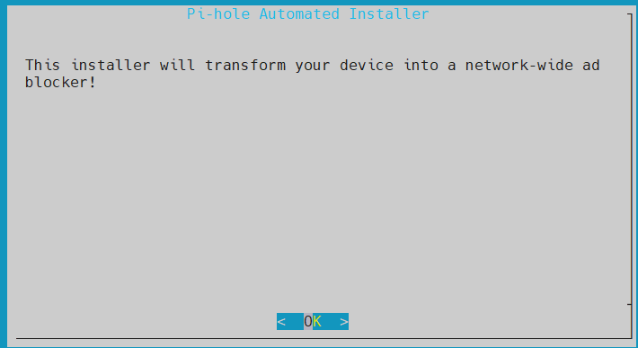

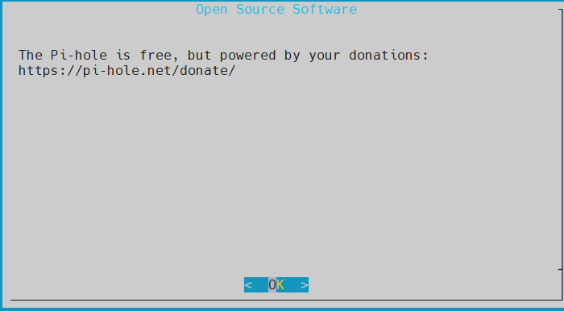

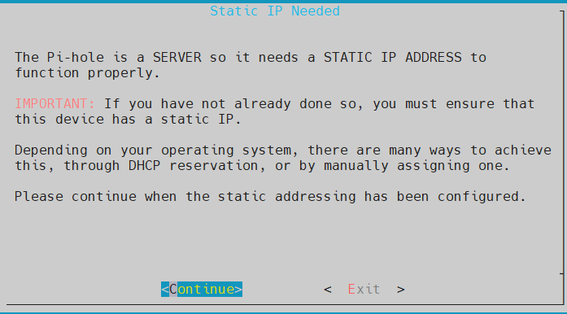

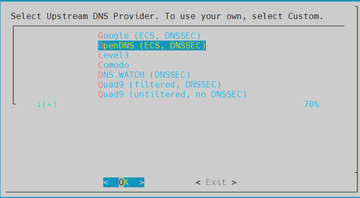

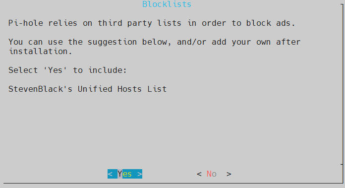

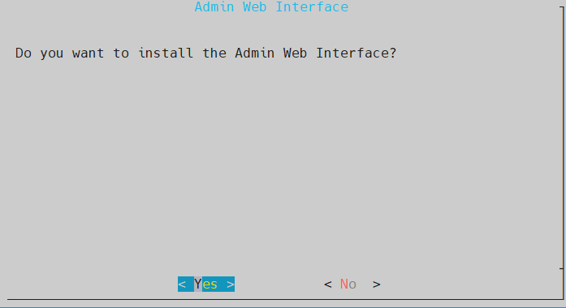

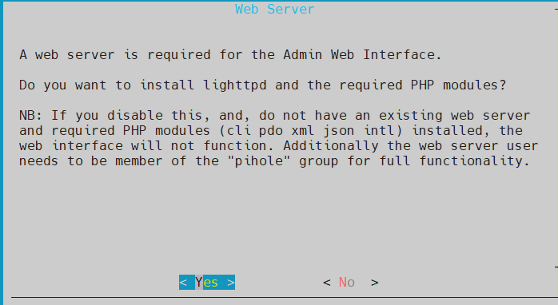

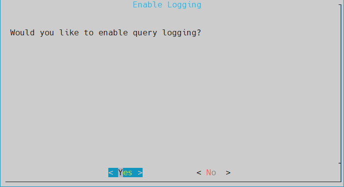

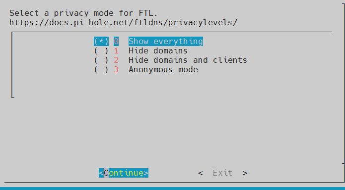


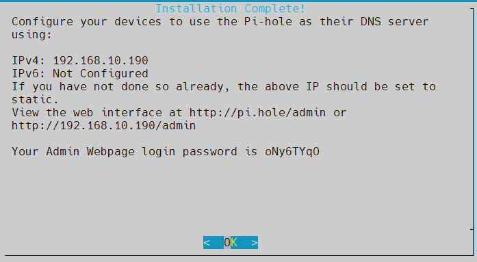


#### To reset or set the Pi-hole `admin` password:


```
pihole --help
```

_Remove the password (not recommended):_

```
pihole -a -p


Enter New Password (Blank for no password): admin123
Confirm Password:
  [✓] New password set
```


_Set a new password:_

```
pihole -a -p [new_password]
```


_Check pi-hole status:_

```
pihole status

  [✓] FTL is listening on port 53
     [✓] UDP (IPv4)
     [✓] TCP (IPv4)
     [✓] UDP (IPv6)
     [✓] TCP (IPv6)

  [✓] Pi-hole blocking is enabled
```


_Uninstall Pi-hole from your system:_

```
pi-hole uninstall
```


### Pi-hole Web Interface:

Open your browser and navigate to: `http://<Static_IP>/admin`. 


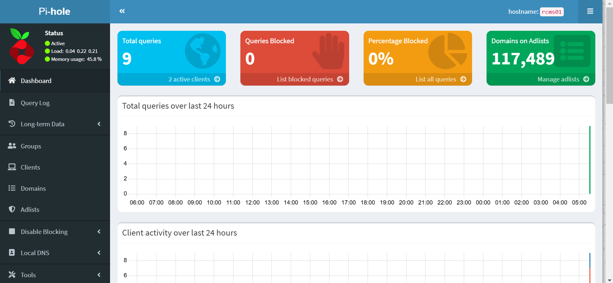


### How To Use pi-hole on Linux:

Configure your router to use the Pi-hole server's IP address as the primary DNS.


### Links:
- [Pi-hole Install | pi-hole.net](https://docs.pi-hole.net/main/basic-install/)
- [Pi-hole Install | github.com](https://github.com/pi-hole/pi-hole)
- [Install and Use pi-hole on Linux](https://computingforgeeks.com/install-and-use-pi-hole-on-linux/)
- [Install Pi-hole on AlmaLinux 9](https://www.speedhub.eu/blog/2024/06/30/how-to-install-pi-hole-on-almalinux-9/)
- [Supported Operating Systems](https://docs.pi-hole.net/main/prerequisites/#supported-operating-systems)
- [To use Pi-hole as their DNS server](https://discourse.pi-hole.net/t/how-do-i-configure-my-devices-to-use-pi-hole-as-their-dns-server/245)


Pi-hole is an effective tool for those looking to enhance their network’s security, speed, and privacy.